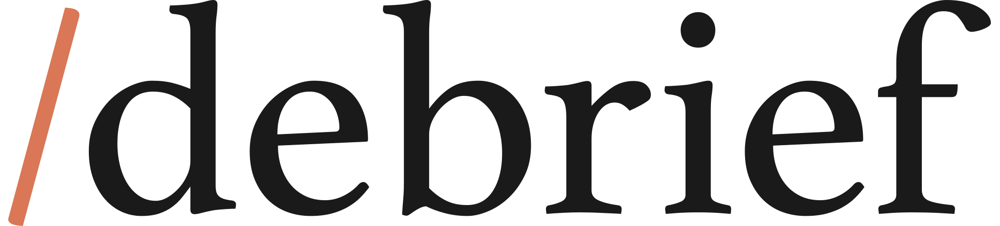

<picture>
  <source media="(prefers-color-scheme: dark)" srcset="assets/logo-dark.svg">
  <source media="(prefers-color-scheme: light)" srcset="assets/logo-light.svg">
  
</picture>
<br><br>

[](https://claude.ai/code)
[](https://github.com/Wavez/debrief-skill/releases)
[](https://github.com/Wavez/debrief-skill/blob/main/LICENSE)

**Catches the wasted tokens, mistimed questions, and repeated mistakes a code review can't
see.** A single-file Claude Code skill for session retrospectives, with no scripts or
dependencies.

*Origin story (soon): [We Review Our Code. Why Don't We Review How We Build It With
AI?](PLACEHOLDER_MEDIUM_URL)*

## When to use it

- **Use** when wrapping up a Claude Code session, or when asked for a debrief, a session
  retrospective, or a post-mortem.
- **Pairs with code review**: code review evaluates the implementation; `/debrief` evaluates
  how the session that produced it went.

## Install

```
/plugin marketplace add Wavez/debrief-skill
/plugin install debrief-skill@debrief-skill
```

> [!TIP]
> To auto-update: run `/plugin` → **Marketplaces** → select `debrief-skill` → **Enable
> auto-update**.

## Usage

Run `/debrief` at the end of a session so Claude stops repeating the same process mistakes and
gets better at working with you over time.

Read-only and self-contained: it **never edits files or saves memory unless you explicitly
approve it**.

## What it checks

- **Efficiency and token usage**
  - Redundant tool calls, unnecessary re-reads, and missed batching or parallelization, so
    you catch wasted tokens and time before they repeat next session.
  - Overlapping-dispatch: two subagents that independently redid each other's work.
  - Context-seam: whether anything had to be re-established after a long session's context
    got summarized.
- **Collaboration and communication quality**
  - Questions asked when needed and skipped when the answer was already checkable, standing
    instructions honored or missed, and whether replies stayed concise.
  - Timing check: a question that's reasonable in content but lands before you've signaled
    you're done giving feedback.
- **Correctness and process discipline**
  - Unverified claims, hard-to-reverse actions taken without confirming, overlooked project
    conventions.
  - Constraint-timing: whether hard requirements were confirmed before finalizing a plan, or
    only discovered after the work was done.
- **Follow-through for next time**
  - What's worth saving from this session so it doesn't need to be re-learned next time.
  - Regression check: cross-references findings against saved feedback/memory, so a repeated
    mistake reads as a regression, not a first-time miss — and can surface a hook suggestion
    instead of another memory or CLAUDE.md note, since memory/CLAUDE.md can only describe
    desired behavior while a hook can enforce it.
  - Missing tools or scripts: hand-writing the same logic twice in a session is itself flagged
    as a signal that a reusable script or skill asset is missing.

## Example output

> **Overall assessment**
> Mostly efficient session, one timing slip worth flagging.
>
> **Concrete issues**
>
> 🔴 **High (regression): Claimed the fix was "done" before running the test suite.**
> - Already saved to project memory after a near-identical incident last session — same
>   mistake, not a first-time miss.
>
> 🟡 **Medium: Asked whether the architecture was finalized while you were still listing
> constraints.**
> - A mistimed question — reasonable in content, asked before you'd signaled you were done
>   giving feedback.
>
> 🟢 **Low: Re-read config.py three times after no edits had been made to it.**
>
> **What went well**
> - Batched the four independent file edits into a single parallel tool call.
>
> **💡 Suggested improvements**
> - **A project hook** (`.claude/settings.json`) — the "claimed done before testing" rule was
>   already in *project* memory and got violated anyway; a Stop hook that blocks claiming
>   completion before test output is actually captured would enforce it where the memory note
>   didn't. Project-scoped, not global, since the rule itself was only ever project memory.
> - **Global `CLAUDE.md`** — from the Medium finding above: wait for an explicit "done giving
>   feedback" signal before asking the user to decide between options, even when the question
>   itself is reasonable. General collaboration habit, not specific to this repo.

## Compared to other retrospective tools

If you already use a different retrospective tool, here's how this one differs:

| Alternative | What it does differently |
|---|---|
| [`bitwarden/ai-plugins` `claude-retrospective`](https://github.com/bitwarden/ai-plugins/tree/main/plugins/claude-retrospective) | Heavier: pulls git history and examines existing code-quality metrics via companion shell scripts from Bitwarden's plugin ecosystem. A full session audit, not a lightweight process check. |
| [`TerenceBristol/claude-improve`](https://github.com/TerenceBristol/claude-improve) | A continuous, multi-run configuration-improvement system tracking acceptance rates across sessions over time — an ongoing machine, not a single end-of-session retrospective. |
| [`session-report`](https://github.com/anthropics/claude-plugins-official/tree/main/plugins/session-report) (official Anthropic plugin) | Narrative call-outs on token waste and cost anomalies from usage data — not a judgment of the collaboration or process itself. |

## Changelog

See [CHANGELOG.md](docs/CHANGELOG.md) for release history.

## License

[MIT](LICENSE)
